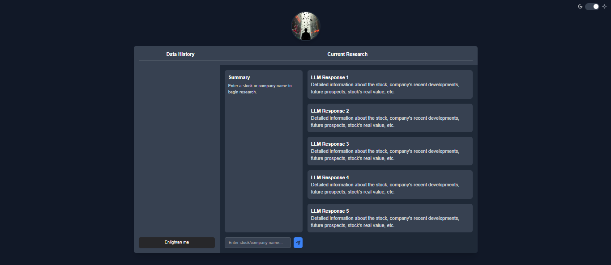

<a id="readme-top"></a>

<!-- PROJECT LOGO -->
<br />
<div align="center">
  <a href="https://github.com/othneildrew/Best-README-Template">
    
  </a>

  <h1 align="center">INFOGO</h1>

  <p align="center">
    a RAG-based intelligent smart knowledge assistant for the financial services industry
    <br />
    <a href="https://github.com/othneildrew/Best-README-Template"><strong>Explore the docs »</strong></a>
    <br />
    <br />
    <a href="https://github.com/othneildrew/Best-README-Template">View Demo</a>
    ·
    <a href="https://github.com/othneildrew/Best-README-Template/issues/new?labels=bug&template=bug-report---.md">Report Bug</a>
    ·
    <a href="https://github.com/othneildrew/Best-README-Template/issues/new?labels=enhancement&template=feature-request---.md">Request Feature</a>
  </p>
</div>


<!-- TABLE OF CONTENTS -->
<details>
  <summary>Table of Contents</summary>
  <ol>
    <li>
      <a href="#about-the-project">About The Project</a>
      <ul>
        <li><a href="#built-with">Built With</a></li>
      </ul>
    </li>
    <li>
      <a href="#getting-started">Getting Started</a>
      <ul>
        <li><a href="#prerequisites">Prerequisites</a></li>
        <li><a href="#installation">Installation</a></li>
      </ul>
    </li>
    <li><a href="#usage">Usage</a></li>
    <li><a href="#roadmap">Roadmap</a></li>
    <li><a href="#contributing">Contributing</a></li>
    <li><a href="#license">License</a></li>
    <li><a href="#contact">Contact</a></li>
    <li><a href="#acknowledgments">Acknowledgments</a></li>
  </ol>
</details>


<!-- ABOUT THE PROJECT -->
## About The Project



<b>INFOGO</b> is a Retrieval Augmented Generation (RAG)-based application designed to enhance stock analysis by leveraging information from multiple online sources. The system gathers data from a diverse set of websites, including financial news, market analysis platforms, and expert blogs, to compile a comprehensive view of a company's stock status. By integrating RAG, the application intelligently retrieves relevant data, analyzes it, and generates informed insights, helping investors make better decisions. This approach ensures that the analysis is not limited to a single source, increasing the accuracy and reliability of stock predictions. The application streamlines the research process, saving users time while delivering a nuanced understanding of market trends and company performance.

<p align="right">(<a href="#readme-top">back to top</a>)</p>


### Built With


* ![typescript][typescript]
* ![tailwind][tailwind]
* [![python][python]][Vue-url]
* [![dotnet][dotnet]][Angular-url]
* [![csharp][csharp]][Svelte-url]
* [![aws][aws]][Bootstrap-url]
* [![mongodb][mongodb]][Laravel-url]


<p align="right">(<a href="#readme-top">back to top</a>)</p>


<!-- GETTING STARTED -->
## Getting Started

To set up the project locally, follow these straightforward steps. Clone the repository to your local machine, install the necessary dependencies, and configure the environment settings. Once everything is set up, you can run the project and begin exploring its features.

### Prerequisites


* npm
  ```sh
  npm install npm@latest -g
  ```

### Installation

Below is a simple guide to help you install and set up the app without any external dependencies. Follow the instructions to download the source code, configure the necessary files, and launch the app on your local environment. This setup ensures you can explore the app's features right away without any additional services.

1. Get an API Key at [https://openai.com/index/introducing-chatgpt-and-whisper-apis/](https://openai.com/index/introducing-chatgpt-and-whisper-apis/)
2. Clone the repo
   ```sh
   git clone https://github.com/su-bonbon/HackUTD2024.git
   ```
4. Enter your API keys in .env
   ```js
    OPENAI_API_KEY  = ""
    LANGCHAIN_TRACING_V2 = "true"
    LANGCHAIN_API_KEY = ""
    LANGCHAIN_ENDPOINT = "https://api.smith.langchain.com"
    LANGCHAIN_PROJECT = ""
    USER_AGENT = "Mozilla/5.0 (Windows NT 10.0; Win64; x64) AppleWebKit/537.36 (KHTML, like Gecko) Chrome/120.0.0.0 Safari/537.36"
    MONGO_URI = ""
   ```
5. Change git remote url to avoid accidental pushes to base project
   ```sh
   git remote set-url origin github_username/repo_name
   git remote -v # confirm the changes
   ```

<p align="right">(<a href="#readme-top">back to top</a>)</p>


<!-- USAGE EXAMPLES -->
## Usage

This RAG-based app is designed to simplify the process of gathering and analyzing stock information. Users can input a company name, and the app will search multiple reliable websites, retrieve relevant data, and generate a well-informed decision on the company's stock status. It streamlines research, saving time and providing insights with greater accuracy.

_For more examples, please email to the [sxl230036@utdallas.edu](https://example.com)_

<p align="right">(<a href="#readme-top">back to top</a>)</p>


<!-- CONTRIBUTING -->
## Contributing

Creating this app has been a collaborative effort, and we value your feedback and ideas. ***Sujin, Brice,*** and ***Yousuf*** developed this project with sponsorship from Infosys. If you have any suggestions or improvements, feel free to reach out to us. We appreciate your support—thanks for being part of our journey!

1. Fork the Project
2. Create your Feature Branch (`git checkout -b feature/AmazingFeature`)
3. Commit your Changes (`git commit -m 'Add some AmazingFeature'`)
4. Push to the Branch (`git push origin feature/AmazingFeature`)
5. Open a Pull Request


<p align="right">(<a href="#readme-top">back to top</a>)</p>


<!-- CONTACT -->
## Contact

Team INFOGO - [@InfoGo](sxl230036@utdallas.edu) - sxl230036@utdallas.edu

Project Link: [https://github.com/su-bonbon/HackUTD2024.git](https://github.com/su-bonbon/HackUTD2024)

<p align="right">(<a href="#readme-top">back to top</a>)</p>


<!-- ACKNOWLEDGMENTS -->
## Acknowledgments

Team INFOGO would like to take this opportunity to acknowledge the resources and support that have been instrumental in the development of this project. Below are some of the key tools, references, and individuals who contributed to our success. We're grateful for their guidance and expertise!

* [InfoSys](https://www.infosys.com/)
* [University of Texas at Dallas](https://www.utdallas.edu/)
* [HackUTD](https://hackutd.co/)

<p align="right">(<a href="#readme-top">back to top</a>)</p>


<!-- MARKDOWN LINKS & IMAGES -->
<!-- https://www.markdownguide.org/basic-syntax/#reference-style-links -->
[contributors-shield]: https://img.shields.io/github/contributors/othneildrew/Best-README-Template.svg?style=for-the-badge
[contributors-url]: https://github.com/othneildrew/Best-README-Template/graphs/contributors
[forks-shield]: https://img.shields.io/github/forks/othneildrew/Best-README-Template.svg?style=for-the-badge
[forks-url]: https://github.com/othneildrew/Best-README-Template/network/members
[stars-shield]: https://img.shields.io/github/stars/othneildrew/Best-README-Template.svg?style=for-the-badge
[stars-url]: https://github.com/othneildrew/Best-README-Template/stargazers
[issues-shield]: https://img.shields.io/github/issues/othneildrew/Best-README-Template.svg?style=for-the-badge
[issues-url]: https://github.com/othneildrew/Best-README-Template/issues
[license-shield]: https://img.shields.io/github/license/othneildrew/Best-README-Template.svg?style=for-the-badge
[license-url]: https://github.com/othneildrew/Best-README-Template/blob/master/LICENSE.txt
[linkedin-shield]: https://img.shields.io/badge/-LinkedIn-black.svg?style=for-the-badge&logo=linkedin&colorB=555
[linkedin-url]: https://linkedin.com/in/othneildrew
[product-screenshot]: images/screenshot.png
[Next.js]: https://img.shields.io/badge/next.js-000000?style=for-the-badge&logo=nextdotjs&logoColor=white
[Next-url]: https://nextjs.org/
[React.js]: https://img.shields.io/badge/React-20232A?style=for-the-badge&logo=react&logoColor=61DAFB
[React-url]: https://reactjs.org/
[Vue.js]: https://img.shields.io/badge/Vue.js-35495E?style=for-the-badge&logo=vuedotjs&logoColor=4FC08D
[Vue-url]: https://vuejs.org/
[Angular.io]: https://img.shields.io/badge/Angular-DD0031?style=for-the-badge&logo=angular&logoColor=white
[Angular-url]: https://angular.io/
[Svelte.dev]: https://img.shields.io/badge/Svelte-4A4A55?style=for-the-badge&logo=svelte&logoColor=FF3E00
[Svelte-url]: https://svelte.dev/
[Laravel.com]: https://img.shields.io/badge/Laravel-FF2D20?style=for-the-badge&logo=laravel&logoColor=white
[Laravel-url]: https://laravel.com
[Bootstrap.com]: https://img.shields.io/badge/Bootstrap-563D7C?style=for-the-badge&logo=bootstrap&logoColor=white
[Bootstrap-url]: https://getbootstrap.com
[JQuery.com]: https://img.shields.io/badge/jQuery-0769AD?style=for-the-badge&logo=jquery&logoColor=white
[JQuery-url]: https://jquery.com 
[typescript]: https://shields.io/badge/TypeScript-3178C6?logo=TypeScript&logoColor=FFF&style=flat-square
[tailwind]: https://img.shields.io/badge/tailwindcss-0F172A?&logo=tailwindcss
[python]: https://img.shields.io/badge/python-3670A0?style=for-the-badge&logo=python&logoColor=ffdd54
[dotnet]: https://img.shields.io/badge/-.NET%206.0-blueviolet
[csharp]: https://img.shields.io/badge/c%23-%23239120.svg?style=for-the-badge&logo=csharp&logoColor=white
[mongodb]: https://img.shields.io/badge/MongoDB-%234ea94b.svg?style=for-the-badge&logo=mongodb&logoColor=white
[aws]: https://img.shields.io/badge/AWS-%23FF9900.svg?style=for-the-badge&logo=amazon-aws&logoColor=white
